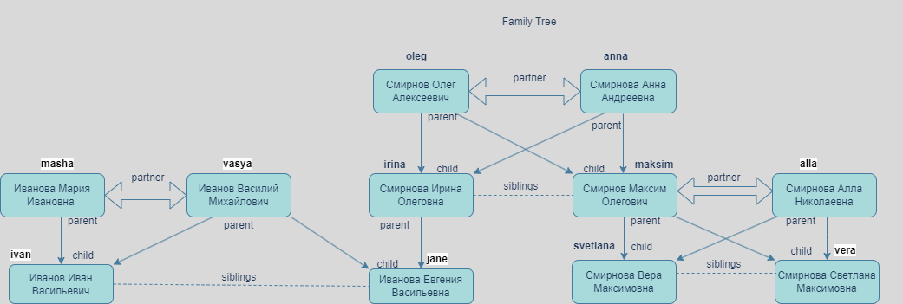

## 1. GeoTree - hw1
Реализовать, с учетом ооп подхода, приложение для проведения исследований с генеалогическим древом.

Идея: описать некоторое количество компонент, например:
* модель человека
* компонента хранения связей и отношений между людьми: родитель, ребёнок - классика, но можно подумать и про отношение, брат, свекровь, сестра и т. д.
* компонент для проведения исследований
* дополнительные компоненты, например отвечающие за вывод данных в консоль, загрузку и сохранения в файл, получение\построение отдельных моделей человека
  Под “проведением исследования” можно понимать получение всех детей выбранного человека.

**О проекте**

Дерево создано по следующей схеме

Загрузка списка членов семьи из файла Data.txt через класс ImportExport

Тестово добавлен один член семьи и перезаписан в обновленный файл newData.txt

## 2. GeoTree - hw2

* добавлен интерфейс сохранения и загрузки GeoTree из файла
* исправлено присвоение id

# 3. GeoTree - hw3

* Research:
  1. исправлены методы поиска родственников, теперь возвращают список персон;
  2. добавлен метод по поиску бабушек-дедушек;
  3. добавлен метод с использованием iterator для удаления умерших людей;
  4. с помощью PersonAgeComparator выполнена сортировка результатов поиска бабушек-дедушек, братье-сестер, детей и родителей в порядке убывания возраста;
* Show:
  1. скорректированы методы вывода результатов в консоль;
  2. добавлены методы просмотра всего дерева - в рандомном порядке и в отсортированном (с применением comparator);
* GeoTree - два метода по добавлению связей заменены одним, в классе Relationship определен абстрактный метод по созданию "зеркальной связи";
* Main - по вышеуказанным изменениям добавлены тесты.

